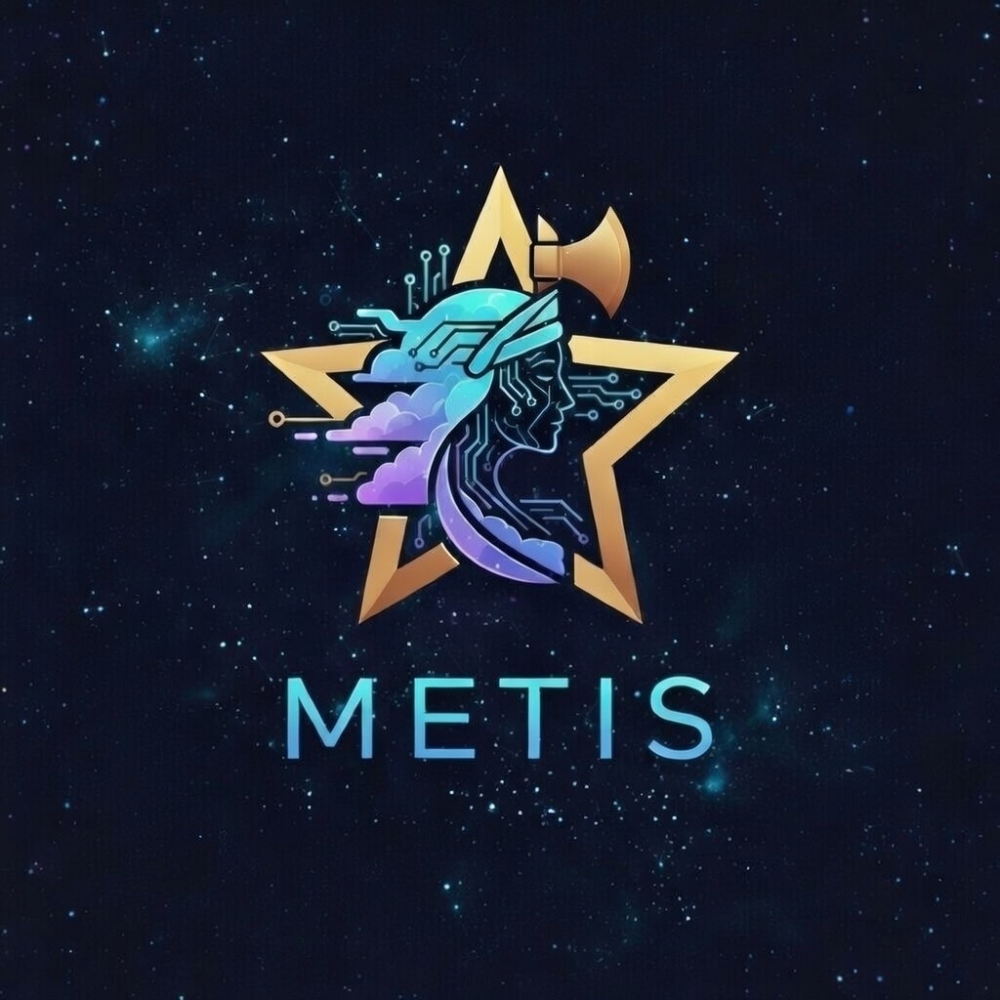

# Metis



Cost-aware swarm orchestration for Claude Code.

Metis helps you ship faster with less token waste by combining:
- structured task workflows,
- capability-based prompting,
- parallel execution for larger backlogs,
- and project-aware learning over time.

If you want one sentence: **Metis makes AI coding sessions more reliable, cheaper, and easier to scale.**

## Why Metis

Most AI coding sessions fail for predictable reasons: unclear requirements, too much context, and poor task boundaries. Metis solves those directly.

- **Plan before code**: Ask and explore first, then implement.
- **Right model, right job**: Use Haiku for cheap discovery, Sonnet for coding, Opus for judgment.
- **Capability subsetting**: Inject only relevant instructions for each task.
- **Built-in workflows**: `/task`, `/swarm`, `/triage`, `/ship`, `/learn`.
- **Self-improving setup**: Learns from what worked and suggests upgrades.

## Quick Start

### 1) Add this marketplace

```bash
/plugin marketplace add chensagi/metis
```

### 2) Install Metis

```bash
/plugin install metis@metis
```

Optional companion for iOS app developers:

```bash
/plugin install ios-qa@metis    # visual QA against the iOS Simulator (bundles the ios-simulator MCP)
```

### 3) Bootstrap your project

```bash
/install
```

`/install` detects your project type, installs a capability profile, and creates a `.metis/` directory with config and state.

## First 10 Minutes

1. Run `/help` to see available commands in your current context.
2. Run `/triage` to audit or organize your backlog.
3. Run `/task` (or `/task --super-ask`) to execute one task end-to-end.
4. For parallel work, run `/swarm` in a dedicated session.
5. When done, run `/ship <branch-name> <commit-message>`.

## Core Workflow

Metis follows a deliberate workflow to reduce rework and cost:

1. **Ask**: clarify requirements and constraints.
2. **Explore**: inspect local code cheaply (`rg`, `glob`, file reads).
3. **Research**: fetch docs only when needed.
4. **Plan**: propose file-level implementation details.
5. **Execute**: run focused implementation with minimal prompt payload.
6. **Verify and ship**: test, review, PR, merge.

This sequence is the reason token usage stays predictable.

## Command Guide

### Daily Workflow (consumer projects)

| Command | What it does | Typical cost tier |
|---|---|---|
| `/help` | Contextual command guide and status | Free (read-only) |
| `/install` | Set up or update `.metis/` | Opus |
| `/migrate` | Import setup from Cursor/Copilot/Windsurf/etc. | Opus |
| `/task [N] [--super-ask]` | Complete one task with planning and verification | Opus + Sonnet/Haiku |
| `/swarm [--budget N] [--controlled]` | Parallel execution loop for backlog throughput | Opus + Sonnet/Haiku |
| `/swarm-tracks [status\|teardown]` | Multi-session parallel dev via git worktrees | Opus |
| `/triage` | Audit tasks against actual codebase state | Opus + Haiku |
| `/triage create "title"` | Create a new backlog task | Opus |
| `/create-tasks` | Interview-driven task generation | Opus |
| `/learn [--deep]` | Analyze patterns and suggest improvements | Opus + Haiku |
| `/add-metiskill` | Create custom project skill | Opus |
| `/ship [branch-name] [commit-message]` | PR creation, CI wait, and merge | Opus |

### Metis Repo Management (for contributors)

| Command | Purpose |
|---|---|
| `/add-capability` | Add and register a new capability |
| `/scaffold-skill` | Scaffold a new core skill |
| `/validate` | Validate skill/capability conventions |
| `/release` | Bump version and tag release |

### iOS QA (optional `ios-qa@metis` plugin)

Install separately with `/plugin install ios-qa@metis`. Bundles the [`ios-simulator`](https://www.npmjs.com/package/ios-simulator-mcp) MCP — no extra setup.

| Command | What it does |
|---|---|
| `/ios-qa [task-number\|--from-pr N\|smoke\|full]` | Spec-driven visual QA against a running simulator |
| `/ios-fixer` | Root-cause analyzer + fixer, auto-invoked by `/ios-qa` for escalations |
| `/qa [PR\|refresh\|exit]` | Lightweight QA session manager — enter / exit / refresh a PR or branch |
| `/qa-batch [PR…\|--dry-run]` | Iterate open PRs, post visual QA + review comments, auto-label clean ones |

See [`plugins/ios-qa/README.md`](plugins/ios-qa/README.md) for configuration and the User Complaint Filter.

## Profiles and Capability System

Metis installs a profile first, then uses capabilities as reusable instruction modules.

### Available profiles

| Profile | Default capabilities | Auto-detection signal |
|---|---|---|
| `react-native-expo` | `typescript`, `react-native`, `expo`, `ios-simulator`, `maestro` (+ optional `zustand`) | Expo + React Native project markers |
| `typescript-node` | `typescript` | `tsconfig.json` + `package.json` (without Expo markers) |
| `python-fastapi` | `python` | `pyproject.toml` / `setup.py` / `requirements.txt` / `Pipfile` |
| `go-service` | `go` | `go.mod` |
| `metis-dev` | `metis-dev` | Metis plugin repo markers |

### Included capabilities

`typescript`, `react-native`, `expo`, `ios-simulator`, `maestro`, `zustand`, `python`, `go`, `rust`, `metis-dev`

### Why capability subsetting matters

A backend task should not carry mobile UI instructions. A typing-only task should not carry API orchestration rules.

Metis subsets capability instructions per work item, usually reducing prompt payload by **60-80%** while improving answer quality.

## The `.metis/` Directory

All project state lives under `.metis/`.

```text
.metis/
├── .gitignore              # Tracks config/capabilities/skills; ignores local runtime state
├── config.json             # Project settings
├── capabilities/           # Installed capability markdown files + manifest
├── skills/                 # Custom project skills
├── agents.json             # Swarm runtime state (local only)
├── learnings.json          # Learning history (local only)
└── tasks/
    ├── todo/
    ├── doing/
    └── done/
```

## Architecture

Metis uses a practical 3-layer model:

| Layer | Role | Typical model |
|---|---|---|
| **L0: Platform** | Your Claude Code session; orchestrates workflow | Any |
| **L1: Spine** | Planning, judgment, synthesis | Opus |
| **L2: Leaves** | Implementation, exploration, retrieval | Sonnet / Haiku / local models |

Design rule: **Opus decides, leaves execute.**

## Cost Model

Metis is optimized for cost-to-outcome, not raw model power.

- **Haiku**: low-cost exploration and diagnostics.
- **Sonnet**: implementation and code edits.
- **Opus**: planning, arbitration, and high-leverage decisions.
- **Budget controls**: use `/swarm --budget N` to cap spend.
- **Smaller prompts**: capability subsetting + file-scoped plans.

## Typical Usage Patterns

### Single task, high confidence

```text
/help
/task
/ship fix-auth "Fix auth session refresh"
```

### Ambiguous or risky task

```text
/task --super-ask
```

Use this when requirements are unclear or edge cases matter.

### Backlog throughput mode

```text
/swarm --budget 10
```

Run this in a dedicated session for continuous processing.

### Migration from another orchestrator

```text
/migrate
```

Supports migration from Cursor, GitHub Copilot, Windsurf, Aider, Continue, Roo Code, and Cline setups, otherwise - just tell your metis. 

## Repository Layout

```text
metis/
├── .claude-plugin/
│   └── marketplace.json        # declares both plugins below
├── plugins/
│   ├── metis-core/             # /plugin install metis@metis
│   │   ├── .claude-plugin/
│   │   │   └── plugin.json
│   │   ├── capabilities/
│   │   │   ├── registry.json
│   │   │   └── <capability>/capability.md
│   │   ├── profiles/
│   │   │   └── *.json
│   │   ├── skills/
│   │   │   └── <skill>/SKILL.md
│   │   ├── hooks/
│   │   │   └── hooks.json
│   │   └── README.md
│   └── ios-qa/                 # /plugin install ios-qa@metis (optional)
│       ├── .claude-plugin/
│       │   └── plugin.json
│       ├── .mcp.json           # bundles ios-simulator-mcp
│       ├── skills/
│       │   └── <skill>/SKILL.md
│       ├── LICENSE
│       └── README.md
├── CLAUDE.md
└── README.md
```

## Contributing

For architecture and development conventions, see `CLAUDE.md`.

Community contributions are welcome, especially:
- new capabilities,
- skill improvements,
- and profile detection refinements.
